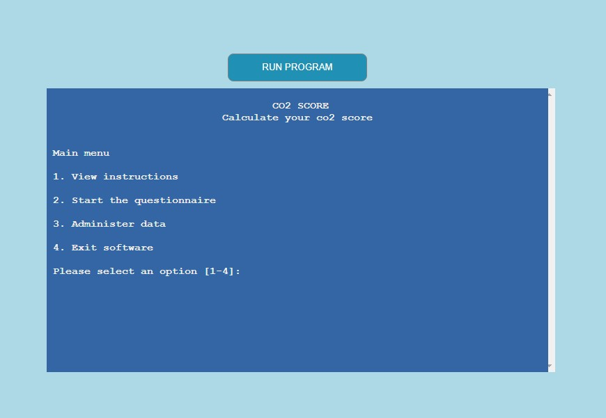
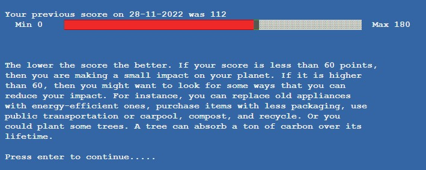
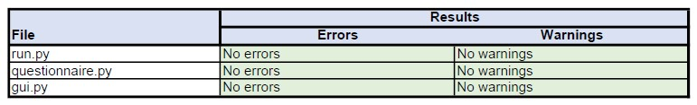
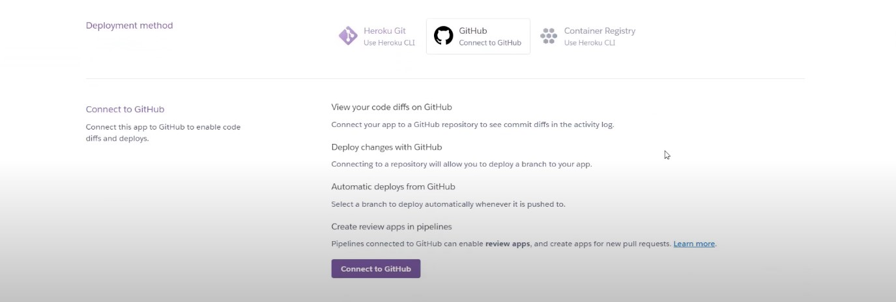

# **CO2 Score**
['CO2 score'](https://co2-score.herokuapp.com/) is a piece of software that runs in a mock terminal developed by [Code Institute](https://codeinstitute.net/) and is hosted on [Heroku](https://www.heroku.com/).

'CO2 Score' provides the user with a score that presents the amount of carbon dioxide that their current lifestyle contributes to the atmosphere. Carbon dioxide and their equivalents contribute to global warming and the risk of irreparable damage to our ecosystem. It is a topic that is close to the hearts of many.

Based on the questions provided on wikiHOW.com, the questionnaire caters for those with a passing interest and those who wish to optimise their lifestyle and monitor their performance improvement by repeating the questionnaire on different dates and comparing their current and previous scores. The questions provide useful information that can help to guide the user in improving their carbon score by altering their lifestyle should they wish to do so.

- [Link to live 'CO2 Score' terminal site](https://co2-score.herokuapp.com/)

## **Contents**

1 [Project Initiation](#1-project-initiation)

2 [Questionnaire tool development](#2-questionnaire-tool-development)

3 [Instructions](#3-instructions)

4 [Features](#3-features)

5 [Testing](#4-testing)

6 [Project Sign Off](#5-project-sign-off)

7 [Releases](#6-releases)

8 [Deployment](#7-deployment)

9 [Technologies Use](#8-technologies-used)

10 [Credits](#9-credits)

## **1. Project Initiation**
- User stories
  
  User stories were ascertained for the game along with the features required to satisfy the user stories. A feature list was developed that covered all of the user stories requirements and it was ensured that there was no duplicated feature functionality going into development.

  - [User Stories](docs/pdfs/readme-user-stories.pdf)
  - [User stories acceptance criteria](docs/pdfs/readme-user-story-acceptance-criteria.pdf)
  - [Feature list with acceptance criteria](docs/pdfs/readme-feature-acceptance-criteria.pdf)

## **2. Questionnaire Tool Development**
  - ### **Tool Functionality Development**

    - ### Interface Mockups
      The tool is implemented using the Python ‘backend’ language and is made available on the internet in a desktop browser via a mock terminal coded by [Code Institute](https://codeinstitute.net/). As such the requirement for user interface design was minimal especially in terms of the web page itself. The web page was developed in advance by Code Institute but could be custom styled prior to deployment.

      -  [Desktop mockups](docs/pdfs/readme-desktop-mockups.pdf)

  - ### **'CO2 Score' Style Development**

       Styling of the HTML, (HTML supplied by Code Institute), was possible but was to remain minimal so as not to distract from the terminal itself and the software output presented within it which was to be the focus of the users’ attention. 

    - **Interface Layout**

      For aesthetics, the mock terminal is centred within the HTML page in which it is presented and, again for aesthetics, the ‘run program’ button is horizontally centred above the mock terminal.

      

      The CLI itself is hardcoded to 80 character cell columns and 24 character cell rows which was a constraint of the project.

      Within the CLI, images are centred for aesthetics and text is printed to the command line interface such that it is one character in from the edge for readability. Any requests to press enter to continue are at the bottom of the terminal.

    - **Typography**

      The title for the CO2 Score tool was generated by [Ascii Art Generator]( https://patorjk.com/software/taag/) and copied into the software.

      

      The font and size of all other text within the software output is dictated by and hardcoded into the software that generates the mock terminal and cannot be altered.

    - **Colour Scheme**

      The theme of the software being related to Earth’s atmosphere, a harmonious colour scheme inspired by the colours commonly used to depict Earth from space were chosen. Images were designed in blues and greens and the interface and text were styled blue and white respectively.

      The exception to this was the result page score bar which is green if the total score is less than or equal to the recommended level of 60 and red if it is above 60.
      
      The colour scheme of the CLI is restricted to those that the mock terminal can generate, that can be accessed by ANSI Escape characters and functions made available through the [Colorama Python library]( https://pypi.org/project/colorama/)

      

    - **Images and Graphics**

      Images and graphics possible within the CLI are extremely rudimentary. 

      2 character cells next to each other horizontally take up a square region of the CLI therefore, with the CLI being 80 characters across by 24 down, bitmaps of 40 by 24 pixels can be transferred to the CLI by colouring full cell ASCII characters appropriately and printing them to the screen using the bitmap as a template.

      

A 40 x 24 pixel image of Earth was produced in a [Corel Paint](https://www.coreldraw.com/en/pages/photo-editing/) to be used as an image to be shown on startup. (click to expand)

    
      
      

          

      

A background with a white frame was produced in a [Corel Paint](https://www.coreldraw.com/en/pages/photo-editing/) to be used as a backgound for the software title. (click to expand)

    
      
      

       

      

The same principle of colours and printing full cell ascii characters to the screen was used to produce bar charts to depict the proportion that the users score represents compared to the maximum possible score. (click to expand)

    
      
      

       

    - **User Feedback**

      User feedback is by means of the requested action being seen to have taken place. For example, the user requesting that they be taken to the main menu followed by them seeing that they have been returned to the main menu. 

      On other occasions, for example to confirm that their data has been deleted from the system, there will be a printed message that confirms the requested action has been taken place.

  - ### **Software Logic**

    A flow diagram was developed that incorporated all of the features that were ascertained as required to fulfil the user stories. 

    - [Software Logic Flow Diagram](docs/pdfs/readme-feature-code-design-v1.pdf)

    Algorithms were outlined along with some pseudo code for the key functions of the software. 

    - [Python Code Outline and Pseudo Code](docs/pdfs/readme-pseudo-code.pdf)

  - ### **Software Structure**

    The main functionailty is within [run.py](run.py)

    The following additional python libraries were produced to support the main functionality:

    - Libraries developed for the project
      |Library|Function|
      |-------|--------|
      |[gui](gui.py)|used to style the user interface and produce graphics|
      |[questionnaire](gui.py)|used to build the questionnaire data structure from the external google spreadhseet|

  - ### **Data Model**

    The data models are for the questions and the user.

      - **Questionnaire**
      
        The questionnaire itself is read from the external spreadsheet via a Google Cloud, Google Spreadsheet API into a dictionary containing the following keys:
        
        - “Instructions”:  [String] Questionnaire instructions
        
        - “Questions”: [List] An array of questions held in sequential order 
        
        - “Summary”: [String] Summing up notice displayed at the end of the questionnaire
        
        Each question is an instance of the Question class (defined in [questionnaire.py])(questionnaire.py). It holds the question string (what the user is being asked to respond to), the maximum possible integer score for the question and sequentially ordered list of question answer options that the user choses from.
        
        One questionnaire instance exists whilst the software is running and this contains as many Question instances as there are in the spreadsheet, which, with its current content, is 12 questions. 

      - **User**

        - The User class, define in [run.py]( run.py) holds the following:

          - User_id: [string] A 5 randomly generated 5 character alphanumeric code
          -  Previous_user: [boolean] Whether the user has played before or not
          Session_results: [dictionary] which contains:
              -  Date: [string] Date of questionnaire completion
              -  Results: [list] The score of each of the answers given by the user
              -  Final_score: [integer] The sum of all the scores in the ‘results’ list

          - The User class also contains a method ‘date’ that populates the User instance: session results: date variable with the date that the questionnaire was answered.

        - A child PreviousUser class is also defined. Its parent class is User. It is initialised with previous_user being True and holds the additional information:

          - Previous_results: [dictionary] which contains the following previous session information read from the external spreadsheet and is looked up using any given user id:
            - Date: [string] Date of questionnaire completion
            - Results: [list] The score of each of the answers given by the user
            - Final_score: [integer] The sum of all the scores in the ‘results’ list

  - ### **External Spreadsheet**

    An external Google Spreadsheet was selected as the data repository. It holds the questionnaire details that are read into the software on load as the user responses and scores. 
    
    The benefit of the questionnaire being read in from the spreadsheet on load is that it could quickyl be updated without modification to any code or redeployment. The software is simply restarted in order to update the questions held within it. 

    The Google Spreadsheet is accessed via the Google Sheets API. The Spreadsheet format can be found below. For security, the API keys are in a file called creds.json that is included in the gitignore file and is never uploaded to GitHub.

    - [CO2 Score Google Spreadsheet](docs/pdfs/readme-co2-score-spreadsheet.pdf)

  - ### **Software Dependencies**

    - External Imported library dependencies developed by third parties
      |Library|Function|
      |-------|--------|
      |time|sleep method used to implement a delay between images being shown on software startup|
      |sys|exit method is used to stop the software|
      |string|ascii_letters method is used to populate a list with all upper and lowercase alphabet characters to use as a pool to randomly select from when generating a user id|
      |random|random method is used to ‘choose’ characters from a character list when generating a user id|
      |copy| deepcopy method is used to copy a users current session to a previous session variable if the user decides to repeat the questionnaire within the same visit to the software|
      |math|ceil used to round up the proportion variable when generating a bar chart|
      |datetime|datetime is used to populate date fields with the date of the session|
      |gspread|used to create, read, update and delete data within the external Google Spreadsheet|
      |google.oauth2service_account : credentials|used to gain access to the external google spreadsheet|
      |colorama|used for terminal foreground and background styling|
      |pil : image|used to open and load bitmap images into the software|
      |numpy|used to convert the image into an array for accessing the pixel data within the software|

  - ### **Security**

    In the interest of security, the current session results variable is deleted from the system before the software returns the user to the main menu in the event that the user choose not to have their data saved.

    When the user elects to have their data saved they are allocated a random 5 character alphanumeric code with which to retrieve their data. Their questions answer scores and their total score along with the date of the session are stored in the external spreadsheet along with this random code. No other personal data, (for example, name, address, age, email, phone number) are stored. 

    Should the user wish to do so they can delete their user id along with any associated data from the ‘Administer data’ menu.
    
    The decision not to take and store any personal information was to ensure that the statistical information that the users results represent could be used for later analysis without risk of releasing any personal user information.

## **3. Instructions**

  The tool provides an estimate of the carbon dioxide and carbon dioxide equivalents produced by the user by asking the user a set of questions the answers each of which have a number of points associated with them.

  - The software logs the number of the points that the user has received for each of the answers that they give and the sum of these points becomes the users final score or ‘carbon score’.

  - The lower the users score the better. If the score is less than 60 points, then the user is making a small impact on your planet. If it’s higher than 60, then it is suggested that the user might want to look for some ways that they can reduce their impact.

  - Suggestions given to the user are that they can replace old appliances with energy-efficient ones, purchase items with less packaging, use public transportation or a carpool, compost, and/or recycle.

  - The user could plant some trees. A tree can absorb a ton of carbon over its lifetime.

  - When the user has completed the questionnaire they can elect to have their results stored in the external spreadsheet for later retrieval and comparison to a future result they can achieve.
  
  - Although there is no personal information held, apart from the questionnaire responses and final score, the user can choose to delete their data from the external spreadsheet should they wish to do so via the ‘Administer data’ menu reached from the ‘Main menu’.

## **4. Features**
  Multiple user stories are dependent on each of the features and links to the dependent user stories and their respective acceptance criteria are provided along with links to the feature list and the features’ acceptance criteria.

  -	###  **Title Screen** [[Feature]( docs/pdfs/readme-feature-acceptance-criteria.pdf) ‘Title Screen’ (ID1)]
    -	The ‘Title Screen’ (ID1) [Feature]( docs/pdfs/readme-feature-acceptance-criteria.pdf) ‘Title Screen’ (ID1) is a dependency of all of the [user stories]( docs/pdfs/readme-user-stories.pdf)
    -	Implemented in [run.py](run.py) and [gui.py](gui.py)
    
    The opening sequence with an image of Earth followed by the title screen is the user’s introduction to the software. 
    For new users an image of the Earth ‘sets the scene’ for the questionnaire that follows and the blues and greens, inspired by the colours of Earth, are harmonious and calming help improve the users experience.
    
    
    
    The title ‘CO2 Score’ and tag line ‘Calculate your co2 score’ on the subsequent title screen immediately indicates the purpose of the software to the user.
    
    

  -	###  **Options menu** [[Feature]( docs/pdfs/readme-feature-acceptance-criteria.pdf) ‘Options menu’ (ID2)]
    -	The ‘Options menu’ (main menu) (ID2) [Feature]( docs/pdfs/readme-feature-acceptance-criteria.pdf) ‘Options menu’ (ID1) is a dependency of all of the [user stories]( docs/pdfs/readme-user-stories.pdf)

    -	Implemented in [run.py](run.py)

    The ‘Options menu’, (main menu) is in the common interface theme of a blue background and white text.
    As the user would expect, it has a title ‘main menu’ and it provides access to all of the main features of the software.

    

    When the user is logged in it shows the user id of the user logged in at the top and an additional meu option of log out is added to the bottom of the options list.

    

    Options entered by the user are validated. If they are out of range, invalid characters or no option has been entered then the user is given as many chances as they need to enter a valid option. Examples of validation responses are shown below.

    

No option selected (Click to expand)

    
    
    

     
    

Option selected out of range (Click to expand)

  
    
    

     

    

Invalid characters entered (Click to expand)

  
    
    

     

  -	###  **Instructions** [[Feature]( docs/pdfs/readme-feature-acceptance-criteria.pdf) ‘Instructions’ (ID3)]

    -	The ‘Instructions’ (ID3) [Feature]( docs/pdfs/readme-feature-acceptance-criteria.pdf) ‘Instructions’ (ID3) is a dependency of all of the [user stories]( docs/pdfs/readme-user-stories.pdf)

    -	Implemented in [run.py](run.py)

    As the user would expect, the Instructions feature gives an overview of the relevance and use of the ‘CO2 score’ tool.

    Once read the user can choose to go directly to the questionnaire which is efficient than having to go back to the main menu first. However, should the user wish to return to the main menu they also have that option.

    

  -	###  **Carbon Questionnaire** [[Feature]( docs/pdfs/readme-feature-acceptance-criteria.pdf) ‘Carbon Questionnaire (ID4)]

    -	The ‘Carbon Questionnaire’ (ID4) [Feature]( docs/pdfs/readme-feature-acceptance-criteria.pdf) ‘Carbon Questionnaire‘ (ID4) is a dependency of user stories 1 and 2 [user stories]( docs/pdfs/readme-user-stories.pdf)

    -	Implemented in [run.py](run.py), [questionnaire.py]( questionnaire.py) and google sheets

    The ‘Carbon Questionnaire’ If the main feature of the software.

    The software reads the questionnaire into variables when the software first runs. The reason for this design choice was so that should the need arise the questionnaire tool can easily be repurposed or the questions modified.

    Modifying the questions is as simple as altering the text in the external spreadsheet and restarting the software. To repurpose the software for a completely new questionnaire would require changes to the title screen such that they are fit for purpose.

    Each question is presented to the user and the software waits for an answer option to be selected.
    The option selected by the user is validated. The software checks that an option has been entered,  whether or not the option selected is in range and whether it consists of valid characters.

    

    Once confirmed to be valid the user has is shown a bar chart that shows the number of points that they have just received towards their carbon score as a proportion of the maximum number of points that they could have received.

    

    If the user is logged in then they are shown a bar chart of the score they were previously given as well.

    

  -	###  **Carbon Footprint Score** [[Data Feature]( docs/pdfs/readme-feature-acceptance-criteria.pdf) ‘Carbon Questionnaire (ID5)]

    -	The ‘Carbon Footprint Score’ (ID5) [Data Feature]( docs/pdfs/readme-feature-acceptance-criteria.pdf) ‘Carbon Footprint Score‘ (ID5) is a dependency of user stories 1 and 2 [user stories]( docs/pdfs/readme-user-stories.pdf)

    -	Implemented in [run.py](run.py)

    Once all of the questions have been answered, the number of points allocated to each of the question responses are summed and the final score displayed to the user with their score shown as a proportion of the 180 maximum score possible on the questionnaire.

    If the users final score is less than or equal to 60, the recommended highest score, then the bar is coloured green else it is coloured red.

    

    If the user is logged in, they are also shown their previous final score for comparison.

    

  -	###  **Store Menu** [[Feature]( docs/pdfs/readme-feature-acceptance-criteria.pdf) ‘Store Menu' (ID6)]

    -	The ‘Store Menu’ (ID6) [Feature]( docs/pdfs/readme-feature-acceptance-criteria.pdf) ‘Store Menu‘ (ID6) is a dependency of user stories 1 and 2 [user stories]( docs/pdfs/readme-user-stories.pdf)

    -	Implemented in [run.py](run.py)

    Should the user not be logged in and on completion of the questionnaire they are asked to press enter to continue. When they press enter they are taken to the ‘store menu’. They are asked to enter ‘y’ if they’d like to have their date stored or ‘n’ if not.

    The users response is validated and checked for presence, whether it is in range and whether it consists of valid characters.

    

    If the user enters ‘y’ then they are given a random 5 character alphanumeric code that can be used to log in and retrieve their stored data on a subsequent use of the software.

    A random code is used so that no personal data needs to be stored in the external spreadsheet. It is believed that not collecting and storing personal data such as name, address, phone number etc will increase the likelihood of users being happy to fill in the questionnaire and use it to improve their carbon footprint over time.

    Once that the user has noted down their user code and they press enter to continue, their data is stored to the external spreadsheet, they remain logged in and they are returned to the main menu.

    

    If the user enters ‘n’ then they are returned to the main menu and their data is deleted from the software.

  -	###  **Data repository** [[Data Feature]( docs/pdfs/readme-feature-acceptance-criteria.pdf) ‘Data repository' (ID7)]

    -	The ‘Data repository’ (ID7) [Data Feature]( docs/pdfs/readme-feature-acceptance-criteria.pdf) ‘Data repository‘ (ID7) is a dependency of user stories 1 and 2 [user stories]( docs/pdfs/readme-user-stories.pdf)

    -	Implemented in [run.py](run.py) and google sheets

    When the user elects to store their data for the first time, their results are appended to the external google spreadsheet into the ‘co2_scores’ worksheet with their user id and the date of the session.

    

    If the user is logged in when they finish the questionnaire, then their previous results in the spreadsheet are updated with their new session results.

    

  -	###  **Exit Screen** [[Feature]( docs/pdfs/readme-feature-acceptance-criteria.pdf) ‘Exit Screen' (ID8)]

    -	The ‘Exit Screen’ (ID8) [Feature]( docs/pdfs/readme-feature-acceptance-criteria.pdf) ‘Exit Screen' (ID8) is a dependency of user stories 1, 2 and 3 [user stories]( docs/pdfs/readme-user-stories.pdf)

    -	Implemented in [run.py](run.py)

    On selecting ‘Exit Software’ from the main menu, the software displays an exit screen showing the globe and the text ‘Exiting’ before finally ending execution of the program and clearing the screen. The software can be restarted by clicking the ‘Run Program’ button above the mock terminal.

    

  -	###  **Load Saved Data** [[Feature]( docs/pdfs/readme-feature-acceptance-criteria.pdf) ‘Load Saved Data' (ID9)]

    -	The ‘Load Saved Data’ (ID9) [Feature]( docs/pdfs/readme-feature-acceptance-criteria.pdf) ‘Load Saved Data' (ID9) is a dependency of user stories 2 and 3 [user stories]( docs/pdfs/readme-user-stories.pdf)

    -	Implemented in [run.py](run.py)

    If the user is not already logged in and on navigating to the questionnaire the user is asked if they have a user id to retrieve previously their previously stored date. If they press enter without entering an id then they are taken straight to the questionnaire on the assumption they're a new user.

    

    Should they enter a 5 character alphanumeric code they had been given on their previous use of the software, then their previous scores are loaded to compare to their scores of their current session.

    The user id entered by the user is validated. The length of the entered id is checked, the characters in the id are checked for validity and it is checked whether or not the user id entered is in the external spreadsheet. Should the user id fail validation, then the user is given the options of trying again or continuing to the questionnaire (as they may have forgotten their id or accidentally typed an entry).

     

  -	###  **Stored User Menu (Administer Data)** [[Feature]( docs/pdfs/readme-feature-acceptance-criteria.pdf) ‘Stored User Menu' (ID11)]

    -	The ‘Stored User Menu' (ID11) [Feature](docs/pdfs/readme-feature-acceptance-criteria.pdf) ‘Stored User Menu' (ID11) is a dependency of user story 3 [user stories](docs/pdfs/readme-user-stories.pdf)

    -	Implemented in [run.py](run.py)

    On selection of the 'stored user menu', (‘Administer Data’ menu) from the main menu and in the event that they are not logged in, the user is asked if they have a user id using the same screen as described in the ‘Load Saved Data’ feature.

    If the user presses the enter key without entering a user id, they are taken back to the main menu. 
    If the user enters an id then their id is validated in the same way as described for the ‘Load Saved Data’ feature and if found to be valid their previous data will be loaded and they will be taken to the Administer Data, (‘stored user’) menu.

    

    On pressing enter from the menu, it is checked that an option has been chosen, that the option is in range and that it only contains valid characters. If any of these validation checks fail then the user is taken back to the administer data menu to try again.

    If ‘Review previous data’ is chosen then the user is shown the score loaded from the external spreadsheet along with a bar chart showing their score compared to the maximum possible score and some useful information regarding how they could improve their score.

    Pressing enter when they’re finished reviewing their score takes the user back to the ‘Administer Data’ menu.

    

    Selecting ‘Delete Data’ from the menu triggers the row with the users data in it to be deleted from the external spreadsheet. The user is shown a deletion confirmation screen and asked to press enter to continue. 

    

    On pressing enter they are taken to a screen informing them they have also been logged to reassure them that none of their data remains present in the session. Internally this log out process means that the variables holding their data have been deleted. Pressing enter here will take the user back to the main menu as they no longer need the Administer data menu.

    

    Lastly, the ‘Administer Data’ menu has the option to return to the main menu. Should the user select this option, they remain logged in.

  -	###  **Data Deletion** [[Data Feature]( docs/pdfs/readme-feature-acceptance-criteria.pdf) ‘Data Deletion' (ID10)]

    -	The ‘Data Deletion' (ID10) [Data Feature]( docs/pdfs/readme-feature-acceptance-criteria.pdf) ‘Data Deletion' (ID10) is a dependency of user story 3 [user stories]( docs/pdfs/readme-user-stories.pdf)

    -	Implemented in [run.py](run.py)

    Selecting ‘Delete Data’ from the menu triggers the row with the users data in it to be deleted from the external spreadsheet. The user is shown a deletion confirmation screen and asked to press enter to continue.  

    - Before data deletion:

      

    - Data deletion confirmed in spreadsheet:
    
      

  -	###  **Log Out Screen** [[Feature]( docs/pdfs/readme-feature-acceptance-criteria.pdf) ‘Log Out Screen' (ID12)]

    -	The ‘Log Out Screen' (ID12) [Feature](docs/pdfs/readme-feature-acceptance-criteria.pdf) ‘Log Out Screen' (ID12) is a dependency of user stories 2 and 3 [user stories](docs/pdfs/readme-user-stories.pdf)

    -	Implemented in [run.py](run.py)

    When logged in a ‘Log out’ option is available in the main menu.

    Selecting ‘Log out’ from the main menu deletes the variable containing the users information from the software and takes the user to a page confirming that log out is complete. Pressing enter on this page takes the user back to the main menu.

    

-  ### **Potential Future Features**

    -  An opening sequence animation of the globe spinning could be implemented by creating bitmap frames and putting them in the images folder wo be looped through and printed sequentially to the screen.

    - Keep more than one set of previous session results for the user to see their change in score over time.

    - Chart the user’s improvement in score if more session results are stored.

    - Provide a more suggestions regarding how they could reduce their score such as by telling them which single adjustment would make the largest reduction in their total score.

## **5. Testing**

- ### **Code Validation**
  
  The code written for the project was exclusively in the Python language. All other code dependencies were written by third parties and validation of this code was out of scope.

  - Python Validation
    
    The Python code was validated and its styling checked using the [Code Institute Python Linter](https://pep8ci.herokuapp.com/#)

    

  - Validation error found and corrected 

    A for loop had been used to generate the random user id code and the validator reported that the ‘index’ variable was ‘unused’

    
    
    
    
    The resolution was to replace the for loop with a while loop. An index variable is initialised to 5 (the number of characters required for the user id) and 
    decremented by one on each iteration of the while loop. The while loop repeats whilst index is greater than 5. 
    
    

- ### **Functionailty Tests**

  Tests were carried out on the ['CO2 score'](https://co2-score.herokuapp.com/) app deployed on Heroku.

  - [User story 1 acceptance test results](docs/pdfs/readme-user-story-1-acceptance-test-results.pdf)
    
    

User story 1 demo

  
    
    

     

  - [User story 2 acceptance test results](docs/pdfs/readme-user-story-2-acceptance-test-results.pdf)

  - [User story 3 acceptance test results](docs/pdfs/readme-user-story-3-acceptance-test-results.pdf)

  - [Feature acceptance test results](docs/pdfs/readme-feature-acceptance-test-results.pdf)

  - Note: The mock terminal does not support mobile and the software has not yet been tested on any Linux operating systems.

- ### **Other Testing**

  The software was made available to third parties throughout the development process to ensure that it had been tested by people other than the developer.

- ### **Bugs Found and Resolved or Current**

  |Bug|Resolution|
  |---|----------|
  |Bar charts weren’t representing the scores correctly and the bar was not always 100% filled when the score was the maximum possible score|The round function had been used to determine the proportion of the bar to be filled which meant that it was sometimes rounded down. The resolution was to use math.ceil to round the proportion up after the entire calculation had taken place|
  |The algorithm to calculate the proportion of the bar chart to be coloured wouldn’t work correctly if the score was greater than 55 (the maximum number of character cells available to form the bar)|The only score that can be above 55 is 180, the final score. The algorithm was altered so that  if the score is greater than 55 then the score it and the maximum possible score are both divided by 4 to scale them down below 55 prior to calculating the proportion of the bar to colour|
  |The API call to update the spreadsheet with a user’s new results was failing|The format of the data that was being sent to the API was a list and should have been a list of lists|
  |When the current session results updated the previous session results appeared to be updated to the same values at the same time even though they should have remained unchanged|The software would copy the current session result to the previous session result using ‘=’ which meant that the current session results and previous session results had the same ‘identity’ as could be verified using the python ‘id’ function. The ‘=’ command was replaced with ‘copy.depcopy’ which ensured that current session and previous session were unique entities|
  |Verification that the user id had not already been allocated prior to giving it to the user was not taking place|The google sheet API command ‘find’ was used to confirm that the generated user id had not already been allocated. If ‘find’ returns ‘None’ the user id had=s not already been used|

## **6. Project Sign Off**

  Once all of the user stories and their feature dependencies have passed their respective acceptance tests then the user story as a whole is deemed ready for release.

  The overall user story acceptance test results along with the acceptance test result summaries of their feature dependencies are detailed in the following sign off sheet.

 - [Project Sign Off](docs/pdfs/readme-project-sign-off.pdf)

## **7. Releases**

- ###  Version 1.0 First release : Date 

## **8. Deployment**

The website is hosted on [Heroku]( https://www.heroku.com/) from the main branch of the [co2-score Git repository]( https://github.com/Stephen-J-Whitaker/co2-score)

  **The deployment procedure is as follows:**
  
  

1. Log in or create a new account (click to expand)

 
  
  

   

  

2. From the dashboard, select ‘Create new app’ (click to expand)

 
  
  

   

  

3. Name the app, each apps on the Heroku platform require a unique name, then select a region and click create app (click to expand)

 
  
  

   

  

4. Click on ‘Settings’ in the top menu bar (click to expand)

 
  
  

   

  

5. Click on ‘Reveal Config Vars’ (click to expand)

 
  
  

   

  

6. Enter the confir var details as shown in the image below (click to expand). In the first field enter ‘CREDS’ and copy the entire contents of the creds.json file, containing the Google Spreadsheet access credentials into the empty filed next to it. When complete, click the ‘ADD’ button next to the fields. New empty fields will appear below the CREDS fields. In the first of these fields enter ‘PORT’ and ‘8000’ in the second. When complete, click ADD

 
  
  

   

  

7. Immediately below the config var section is the ‘Buildpacks’ section. Click ‘Add Buildpacks’ (click to expand)

 
  
  

   

  

8. Select ‘python’ and then click ‘Save Changes’ (click to expand)

 
  
  

   

  

9. Select ‘nodejs’ and then click ‘Save Changes’ (click to expand)

 
  
  

   

  

10. The build packs section should look like the image below with python above nodejs. They can be clicked and dragged to rearrange if necessary (click to expand)

 
  
  

   

  

11. Click on ‘Deploy’ on the main menu ribbon at the top of the page and then click ‘GitHub’ (click to expand)

 
  
  

   

  

12. If necessary, confirm that you want to connect to GitHub by clicking ‘Connect to GitHub’ (click to expand)

 
  
  

   

  

13. Search for the GitHub repository name (click to expand)

 
  
  

   

  

14. Click either ‘Enable Automatic Deploys’ which will automatically redeploy the app each time the Git repository is updated, or ‘Deploy Branch’ to deploy the app manually as requried (click to expand)

 
  
  

   

  

15. If ‘Deploy Branch’ was selected the screen will look like the following image when deployment is complete (click to expand)

 
  
  

   

## **9. Technologies Used**

  - [Python](https://www.python.org/)

  - [Corel Draw](https://www.coreldraw.com/en/) : Used for developing the mockups for the website and SVG game pad interface

  - [Corel Paint](https://www.coreldraw.com/en/pages/photo-editing/): Used to create the terminal globe and background graphics

  - [Apple Mac OS](https://apps.apple.com/us/app/macos-big-sur/id1526878132?mt=12) : Used to create screen grabbed movies for user story demonstrations

  - [Adobe Express]( https://www.adobe.com/express/feature/video/convert/video-to-gif): Used to create user story demonstration gifs from mov files

  - [Microsoft Excel](https://www.microsoft.com/en-ie/microsoft-365/excel) : Used for documenting features and recording test results

  - [Microsoft Visio](https://www.microsoft.com/en-ie/microsoft-365/visio/flowchart-software)

  - [Chrome](https://www.google.com/intl/en_ie/chrome/) : Used for research, development and testing

  - [Safari](https://www.apple.com/safari/) : Used for testing

  - [Opera](https://www.opera.com/) : Used for testing

  - [Edge](https://www.microsoft.com/en-us/edge) : Used for testing

  - [Firefox](https://www.mozilla.org/en-US/firefox/new/) : Used for testing

  - [Notepad++](https://notepad-plus-plus.org/downloads/) : Used for text file editing

  - [GitPod](https://www.gitpod.io/) : Used for product development and testing

  - [GitHub](https://github.com/) : Used for accessing committed code repositories and hosting the completed product online

  - [Git](https://git-scm.com/): Used for code version control

  - [Code Institute Python Linter](https://pep8ci.herokuapp.com/#): Used to calidate and check the styling of the Python code

  - Windows 10 snipping tool for creating screen grabbed jpeg files for the readme

  - [Am I Responsive]( https://ui.dev/amiresponsive): Used to create the responsiveness mockup used at the top of this readme file

## **10. Credits**

- ### **Content**
  - All code was written by the author, [Stephen Whitaker](https://github.com/Stephen-J-Whitaker), unless explicitly stated within the code.
  - The mock terminal in which the software runs was developed by and provided by [Code Institute](https://codeinstitute.net/ie/) via a [template for GitPod](https://github.com/Code-Institute-Org/python-essentials-template)
  - The content of the questionnaire was sourced from [wikiHOW](https://www.wikihow.com/Calculate-Your-Carbon-Footprint)
  - [Third party libraries](#software-dependencies) were imported to support the software as described in the [Third party libraries](#software-dependencies) section.
  - Code in order to gain access to the external spreadsheet was provided by [Code Institute](https://codeinstitute.net/ie/)
  - Ascii art was produced using [Ascii Art Generator]( https://patorjk.com/software/taag/)

- ### **Other Sources**
  - Ansi escape codes used for moving the cursor and colouring the terminal were referenced from:
    - [Ansi escape codes](https://gist.github.com/fnky/458719343aabd01cfb17a3a4f7296797)
  - Guidance on the markdown and structure to produce the readme was obtained from :
      - [Markdown Cheatsheet](https://github.com/adam-p/markdown-here/wiki/Markdown-Cheatsheet#code)
      - [Markdown for readme](https://docs.github.com/en/get-started/writing-on-github/getting-started-with-writing-and-formatting-on-github/basic-writing-and-formatting-syntax)

- ### **Acknowledgements**
  - A special thank you to my mentor Maranatha Ilesanmi
  - Thank you to all those who were kind enough to test the website and provide feedback

## [Back To Top](#Contents)