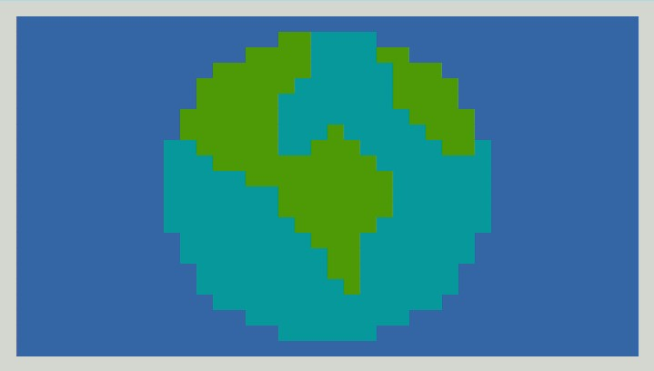

# **CO2 Score**
['CO2 score'](https://co2-score.herokuapp.com/) is a piece of software that provides the user with a score that presents the amount of carbon dioxide that their current lifestyle contributes to the atmosphere. Carbon dioxide and their equivalents contribute to global warming and the risk of irreparable damage to our ecosystem. It is a topic that is close to the hearts of many.
Based on the questions provided on wikiHOW.com, the questionnaire caters for those with a passing interest and those who wish to optimise their lifestyle and monitor their performance improvement by repeating the questionnaire on different dates and comparing their current and previous scores. The questions provide useful information that can help to guide the user in improving their carbon score by altering their lifestyle should they wish to do so.

- [Link to live 'CO2 Score' terminal site](https://co2-score.herokuapp.com/)

## **Contents**

1 [Project Initiation](#1-project-initiation)

2 [Questionnaire tool development](#2-questionnaire-tool-development)

3 [Instructions](#3-instructions)

4 [Features](#3-features)

5 [Testing](#4-testing)

6 [Project Sign Off](#5-project-sign-off)

7 [Releases](#6-releases)

8 [Deployment](#7-deployment)

9 [Technologies Use](#8-technologies-used)

10 [Credits](#9-credits)

## **1. Project Initiation**
- User stories
  
  User stories were ascertained for the game along with the features required to satisfy the user stories. A feature list was developed that covered all of the user stories requirements and it was ensured that there was no duplicated feature functionality going into development.

  - [User Stories](docs/pdfs/readme-user-stories.pdf)
  - [User stories acceptance criteria](docs/pdfs/readme-user-story-acceptance-criteria.pdf)
  - [Feature list with acceptance criteria](docs/pdfs/readme-feature-acceptance-criteria.pdf)

## **2. Questionnaire Tool Development**
  - ### **Tool Functionality Development**

    - ### Interface Mockups
      The tool is implemented using the Python ‘backend’ language and is made available on the internet in a desktop browser via a mock terminal coded by [Code Institute](https://codeinstitute.net/). As such the requirement for user interface design was minimal especially in terms of the web page itself. The web page was developed in advance by Code Institute but could be custom styled prior to deployment.

      -  [Desktop mockups](docs/pdfs/readme-desktop-mockups.pdf)

  - ### **'CO2 Score' Style Development**

       Styling of the HTML, (HTML supplied by Code Institute), was possible but was to remain minimal so as not to distract from the terminal itself and the software output presented within it which was to be the focus of the users’ attention. 

    - **Interface Layout**

      For aesthetics, the mock terminal is centred within the HTML page in which it is presented and, again for aesthetics, the ‘run program’ button is horizontally centred above the mock terminal. 

      The CLI itself is hardcoded to 80 character cell columns and 24 character cell rows which was a constraint of the project.

      Within the CLI, images are centred for aesthetics and text is printed to the command line interface such that it is one character in from the edge for readability. Any requests to press enter to continue are at the bottom of the terminal.

    - **Typography**

      The title for the CO2 Score tool was generated by [Ascii Art Generator]( https://patorjk.com/software/taag/) and copied into the software. 

      The font and size of all other text within the software output is dictated by and hardcoded into the software that generates the mock terminal and cannot be altered.

    - **Colour Scheme**

      The theme of the software being related to Earth’s atmosphere, a harmonious colour scheme inspired by the colours commonly used to depict Earth from space were chosen. Images were designed in blues and greens and the interface and text were styled blue and white respectively. 
      The exception to this was the result page score bar which is green if the total score is less than or equal to the recommended level of 60 and red if it is above 60.
      
      The colour scheme of the CLI is restricted to those that the mock terminal can generate, that can be accessed by ANSI Escape characters and made available through the [Colorama Python library]( https://pypi.org/project/colorama/)

      

    - **Images and Graphics**

      Images and graphics possible within the CLI are extremely rudimentary. 

      2 character cells next to each other horizontally take up a square region of the CLI therefore, with the CLI being 80 characters across by 24 down, bitmaps of 40 by 24 pixels can be transferred to the CLI by colouring full cell ASCII characters appropriately and printing them to the screen using the bitmap as a template.

      A 40 x 24 pixel image of Earth was produced in a [Corel Paint](https://www.coreldraw.com/en/pages/photo-editing/) to be used as an image to be shown on startup.

      

      The same principle of colours and printing full cell ascii characters to the screen was used to produce bar charts to depict the proportion that the users score represents compared to the maximum possible score.

    - **User Feedback**

      User feedback is by means of the requested action being seen to have taken place. For example, the user requesting that they be taken to the main menu followed by them seeing that they have been returned to the main menu. 

      On other occasions, for example to confirm that their data has been deleted from the system, there will be a printed message that confirms the requested action has been taken place.

  - ### **Software Logic**

    A flow diagram was developed that incorporated all of the features that were ascertained as required to fulfil the user stories were. Algorithms were outlined along with some pseudo code for the key functions of the software. 

    - [Software Logic Flow Diagram](pdfs/readme-feature-code-design-v1.pdf)

    - [Python Code Outline and Pseudo Code](pdfs/readme-pseudo-code.pdf)

  - ### **Data Model**

    The data models are for the questions and the user.

      - **Questionnaire**
      
        The questionnaire itself is read from the external spreadsheet via a Google Cloud, Google Spreadsheet API into a dictionary containing the following keys:
        
        - “Instructions”:  [String] Questionnaire instructions
        
        - “Questions”: [List] An array of questions held in sequential order 
        
        - “Summary”: [String] Summing up notice displayed at the end of the questionnaire
        
        Each question is an instance of the Question class (defined in [questionnaire.py])(questionnaire.py). It holds the question string (what the user is being asked to respond to), the maximum possible integer score for the question and sequentially ordered list of question answer options that the user choses from.
        
        One questionnaire instance exists whilst the software is running and this contains as many Question instances as there are in the spreadsheet, which, with its current content, is 12 questions. 

      - **User**

        - The User class, define in [run.py]( run.py) holds the following:

          - User_id: [string] A 5 randomly generated 5 character alphanumeric code
          -  Previous_user: [boolean] Whether the user has played before or not
          Session_results: [dictionary] which contains:
              -  Date: [string] Date of questionnaire completion
              -  Results: [list] The score of each of the answers given by the user
              -  Final_score: [integer] The sum of all the scores in the ‘results’ list

          - The User class also contains a method ‘date’ that populates the User instance: session results: date variable with the date that the questionnaire was answered.

        - A child PreviousUser class is also defined. Its parent class is User. It is initialised with previous_user being True and holds the additional information:

          - Previous_results: [dictionary] which contains the following previous session information read from the external spreadsheet and is looked up using any given user id:
            - Date: [string] Date of questionnaire completion
            - Results: [list] The score of each of the answers given by the user
            - Final_score: [integer] The sum of all the scores in the ‘results’ list

  - ### **External Spreadsheet**

    An external Google Spreadsheet was selected as the data repository. It holds the questionnaire details that are read into the software on load as the user responses and scores. 
    
    The benefit of the questionnaire being read in from the spreadsheet on load is that it could quickyl be updated without modification to any code or redeployment. The software is simply restarted in order to update the questions held within it. 

    The Google Spreadsheet is accessed via the Google Sheets API. The Spreadsheet format can be found below. For security, the API keys are in a file called creds.json that is included in the gitignore file and is never uploaded to GitHub.

    - [CO2 Score Google Spreadsheet](pdfs/readme-co2-score-spreadsheet.pdf)

  - ### **Software Dependencies**

    |Library|Function|
    |---|----------|

## **3 Instructions**

